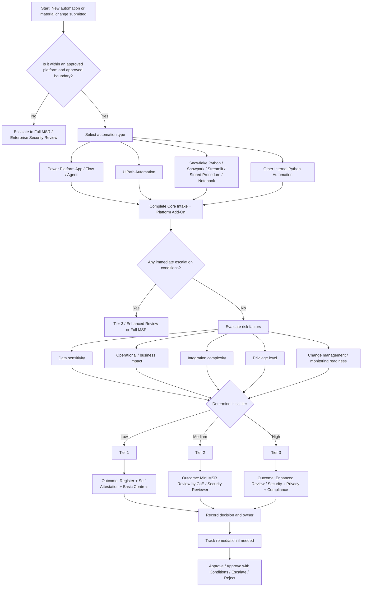

# Mini MSR for Internal Automations on Approved Platforms

Reference: 

## Executive Summary

Mini MSR is a lightweight internal security review process for automations built on approved enterprise platforms, including:

* Power Platform apps, flows, and agents
* UiPath automations
* Snowflake workloads such as Python, Snowpark, Streamlit, stored procedures, and notebooks
* Internal Python automations running within an already approved environment

The purpose of Mini MSR is not to repeat a full enterprise security review for every small automation. Instead, it focuses on application-level residual risk that is not automatically covered by the approved platform.

An approved platform does not automatically mean every app, flow, bot, agent, or script built on it is safe. Internal automations may still create risk if they:

* Access sensitive or regulated data
* Connect to internal or external APIs
* Use credentials, tokens, or secrets
* Perform read, write, update, or delete actions
* Affect business operations, compliance, privacy, or security

## Guiding Principles

* Mini MSR is narrower, not weaker.
* Existing platform controls should be reused where possible.
* The review should focus only on workload-specific residual risk.
* The process should be simple, fast, standardized, and traceable.
* Risk tiering should prevent low-risk automations from being over-reviewed while ensuring higher-risk workloads receive proper oversight.

## Core Review Areas

### 1. Data Access

Review questions:

* What data is read, written, updated, or deleted?
* Is sensitive or regulated data involved?
* Is least privilege applied?
* Are row-level, field-level, or masking controls required?

### 2. API, Connector, and Integration Security

Review questions:

* What systems and endpoints are connected?
* Are custom connectors, HTTP actions, external APIs, or internet egress used?
* Are integrations approved and restricted?

### 3. Credential and Secret Management

Review questions:

* Are secrets hardcoded?
* Are approved vaults or platform-native secret stores used?
* Are credential ownership and rotation defined?
* Are shared or personal production credentials used?

### 4. Change Management and SDLC

Review questions:

* Is the automation stored in source control?
* Is deployment controlled through a pipeline or equivalent process?
* Is rollback defined?
* Are logging, monitoring, and basic testing in place?

## Risk Tiers

### Tier 1: Low Risk

Typical characteristics:

* Sandbox, proof of concept, or limited internal use
* No regulated or highly sensitive data
* No external API or risky internet egress
* No high-privilege access
* Low business impact

Required outcome:

* Registration
* Self-attestation
* Basic controls

### Tier 2: Medium Risk

Typical characteristics:

* Internal production use
* Internal business data or limited personal data
* Internal integrations
* Moderate business-unit impact

Required outcome:

* Mini MSR review by CoE, platform governance, or security reviewer

### Tier 3: High Risk

Typical characteristics:

* Regulated, restricted, or sensitive data
* Custom connectors, HTTP actions, external APIs, or internet egress
* High-privilege execution
* Writes to systems of record
* Agentic or autonomous actions
* Enterprise-wide, operationally critical, or customer-facing impact

Required outcome:

* Enhanced review or escalation to full MSR, security, privacy, or compliance review

## Escalation Red Flags

Any of the following should normally trigger Tier 3 or full review:

* Regulated or highly sensitive data
* External API, internet egress, HTTP action, or custom connector
* Shared or personal production credential
* High-privilege execution identity
* Owner’s rights, privileged robot, or broad write/delete access
* AI agent that can autonomously act on systems of record
* Missing source control, deployment process, logging, monitoring, or rollback
* New hosting boundary
* New trust boundary

## Platform Governance Reuse

Mini MSR should leverage existing platform-native governance capabilities instead of recreating controls from scratch.

| Platform       | Controls to Reuse                                                                                                                 |
| -------------- | --------------------------------------------------------------------------------------------------------------------------------- |
| Power Platform | CoE Starter Kit, DLP, Managed Environments, Pipelines, Power CAT                                                                  |
| UiPath         | Automation Ops, Orchestrator RBAC, Credential Stores, Workflow Analyzer, CI/CD                                                    |
| Snowflake      | RBAC, Secrets, Packages Policy, External Access Integration, Row Access Policies, Masking Policies, Event History, Access History |

## One-Sentence Summary

Mini MSR is a fast, standardized, risk-based security review for internal automations running on approved platforms, designed to evaluate workload-specific residual risk without creating unnecessary delivery friction.

---

# Intake Questionnaire Field List

## Section A: Core Intake

| Field Name            |         Type | Required | Notes                                                         |
| --------------------- | -----------: | -------: | ------------------------------------------------------------- |
| Automation ID         |   Short text |      Yes | Example: FIN-AP-RECON-001                                     |
| Automation Name       |   Short text |      Yes | Example: Invoice Reconciliation Flow                          |
| Business Owner        |   Short text |      Yes | Accountable business owner                                    |
| Technical Owner       |   Short text |      Yes | Maker, developer, or technical lead                           |
| Backup Owner          |   Short text |       No | Secondary contact                                             |
| Platform Type         |     Dropdown |      Yes | Power App, Power Flow, Power Agent, UiPath, Snowflake, Python |
| Automation Sub-Type   |     Dropdown |       No | Canvas App, Cloud Flow, Unattended Bot, Streamlit, Notebook   |
| Business Purpose      |    Long text |      Yes | One to three sentence summary                                 |
| Lifecycle Stage       |     Dropdown |      Yes | New, Material Change, Minor Change, Existing Review           |
| Environment Scope     | Multi-select |      Yes | Dev, Test, Prod                                               |
| Target Go-Live Date   |         Date |       No | Planned release date                                          |
| Expected Lifespan     |     Dropdown |      Yes | Temporary, Ongoing, Mission-Critical                          |
| In Approved Boundary? |       Yes/No |      Yes | Must be Yes for Mini MSR                                      |
| New Trust Boundary?   |       Yes/No |      Yes | If Yes, escalate                                              |
| New Hosting Boundary? |       Yes/No |      Yes | If Yes, escalate                                              |

## Section B: Common Risk Questions

### B1. Data Access

| Field Name                               |         Type | Required | Notes                                            |
| ---------------------------------------- | -----------: | -------: | ------------------------------------------------ |
| Reads Production Data?                   |       Yes/No |      Yes |                                                  |
| Writes or Updates Data?                  |       Yes/No |      Yes |                                                  |
| Deletes Data?                            |       Yes/No |      Yes |                                                  |
| Data Sources                             |    Long text |      Yes | Database, SharePoint, Dataverse, Snowflake, etc. |
| Data Destinations                        |    Long text |      Yes | Where the data is sent or stored                 |
| Sensitive Data Type                      | Multi-select |      Yes | None, PII, PHI, PCI, Financial, SOX, Restricted  |
| Highest Data Sensitivity                 |     Dropdown |      Yes | Public, Internal, Confidential, Restricted       |
| Row or Field Restrictions Applied?       |       Yes/No |       No | Row-level, field-level, masking                  |
| Data Residency or Regulatory Constraints |    Long text |       No | GDPR, state residency, industry requirements     |

### B2. Integrations and APIs

| Field Name                                 |      Type | Required | Notes                            |
| ------------------------------------------ | --------: | -------: | -------------------------------- |
| Uses Internal APIs or Connectors?          |    Yes/No |      Yes |                                  |
| Uses External APIs?                        |    Yes/No |      Yes |                                  |
| Uses Custom Connector or HTTP?             |    Yes/No |      Yes | Critical red flag                |
| Internet Egress Required?                  |    Yes/No |      Yes | Critical red flag                |
| Endpoint List                              | Long text |       No | URLs or destinations             |
| Cross-Tenant or Third-Party Data Transfer? |    Yes/No |      Yes |                                  |
| Approved Integration?                      |    Yes/No |       No | Include approval ID if available |

### B3. Credentials and Secrets

| Field Name                                 |       Type | Required | Notes                                            |
| ------------------------------------------ | ---------: | -------: | ------------------------------------------------ |
| Uses Credentials, Tokens, or Secrets?      |     Yes/No |      Yes |                                                  |
| Any Hardcoded Secret?                      |     Yes/No |      Yes | If Yes, must remediate                           |
| Secret Storage Location                    |   Dropdown |       No | Key Vault, Orchestrator, Snowflake Secret, Other |
| Production Credential Owned by Individual? |     Yes/No |      Yes | Red flag                                         |
| Shared Credential Used?                    |     Yes/No |      Yes | Red flag                                         |
| Rotation Defined?                          |     Yes/No |       No |                                                  |
| Rotation Frequency                         |   Dropdown |       No | 90 days, 180 days, 365 days, Other               |
| Secret Owner                               | Short text |       No |                                                  |

### B4. SDLC, Change, and Monitoring

| Field Name                                 |                   Type | Required | Notes                                          |
| ------------------------------------------ | ---------------------: | -------: | ---------------------------------------------- |
| Source Control Used?                       |                 Yes/No |      Yes | Azure DevOps, GitHub, GitLab                   |
| Repository Link                            |             Short text |       No |                                                |
| Controlled Deployment Process?             |                 Yes/No |      Yes | Pipeline or release process                    |
| Rollback Procedure Defined?                |                 Yes/No |      Yes |                                                |
| Basic Testing Completed?                   |                 Yes/No |      Yes | Functional, negative, and error handling tests |
| Logging Enabled?                           |                 Yes/No |      Yes |                                                |
| Monitoring or Alerting Enabled?            |                 Yes/No |      Yes |                                                |
| Deployment Traceable to Owner and Version? |                 Yes/No |      Yes |                                                |
| Business Impact if Failed                  |               Dropdown |      Yes | Low, Medium, High                              |
| Manual Fallback Available?                 |                 Yes/No |      Yes |                                                |
| RTO                                        | Dropdown or short text |       No | Less than 1 day, 1 to 8 hours, critical        |
| RPO                                        |             Short text |       No |                                                |

---

# Platform-Specific Add-On Fields

## Power Platform Add-On

| Field Name                                   |         Type | Required | Notes                                      |
| -------------------------------------------- | -----------: | -------: | ------------------------------------------ |
| Power Platform Type                          |     Dropdown |      Yes | App, Flow, Agent                           |
| App Type                                     |     Dropdown |       No | Canvas, Model-driven                       |
| Flow Type                                    |     Dropdown |       No | Cloud, Desktop                             |
| Agent Type                                   |   Short text |       No | Copilot Studio or other                    |
| Connector Types Used                         | Multi-select |      Yes | Standard, Premium, Custom, HTTP            |
| DLP Policy Allows All Connectors?            |       Yes/No |      Yes |                                            |
| Uses Service Principal or Shared Connection? |       Yes/No |      Yes |                                            |
| Share with Everyone Enabled?                 |       Yes/No |       No | App sharing concern                        |
| Uses Solutions or Managed Solutions?         |       Yes/No |       No |                                            |
| Uses Pipeline or ALM Process?                |       Yes/No |       No |                                            |
| Human-in-the-Loop Required?                  |       Yes/No |       No | Especially for agents                      |
| Agent Can Write to Systems?                  |       Yes/No |       No | Red flag                                   |
| Telemetry or Audit Enabled?                  |       Yes/No |       No | Purview, App Insights, platform audit logs |

## UiPath Add-On

| Field Name                                              |       Type | Required | Notes                                          |
| ------------------------------------------------------- | ---------: | -------: | ---------------------------------------------- |
| UiPath Type                                             |   Dropdown |      Yes | Attended, Unattended, API Workflow, Agentic    |
| Robot Identity                                          | Short text |      Yes | Account or robot name                          |
| High Privilege Robot?                                   |     Yes/No |      Yes | Red flag                                       |
| Uses Orchestrator Assets?                               |     Yes/No |      Yes |                                                |
| Credential Store Used                                   |   Dropdown |       No | Orchestrator, CyberArk, Azure Key Vault, Other |
| Uses External API or Integration Service?               |     Yes/No |      Yes |                                                |
| Workflow Analyzer Enforced?                             |     Yes/No |      Yes |                                                |
| Publish Blocked on Rule Failure?                        |     Yes/No |       No |                                                |
| Queue, Logs, or Screenshots May Contain Sensitive Data? |     Yes/No |      Yes |                                                |
| REFramework or Equivalent Error Handling?               |     Yes/No |       No |                                                |
| Folder and Role Isolation Configured?                   |     Yes/No |      Yes |                                                |

## Snowflake Add-On

| Field Name                                     |      Type | Required | Notes                                                |
| ---------------------------------------------- | --------: | -------: | ---------------------------------------------------- |
| Snowflake Workload Type                        |  Dropdown |      Yes | Notebook, Snowpark, Streamlit, Stored Procedure, UDF |
| Reads Production Data?                         |    Yes/No |      Yes |                                                      |
| Writes Production Data?                        |    Yes/No |      Yes |                                                      |
| Uses Owner’s Rights?                           |    Yes/No |      Yes | Red flag                                             |
| Uses Restricted Caller’s Rights or Equivalent? |    Yes/No |       No |                                                      |
| Row Access or Masking Applied?                 |    Yes/No |       No |                                                      |
| Sensitive Data Classification Used?            |    Yes/No |       No |                                                      |
| External Access Integration Used?              |    Yes/No |      Yes | Red flag                                             |
| Allowed Domains or Endpoints                   | Long text |       No |                                                      |
| Snowflake Secret Used?                         |    Yes/No |      Yes |                                                      |
| Package Policy or Allowlist Applied?           |    Yes/No |       No |                                                      |
| Uses Personal Account for Production?          |    Yes/No |      Yes | Red flag                                             |
| Query Tag or Event Logging Enabled?            |    Yes/No |       No |                                                      |

## Other Python Add-On

| Field Name                           |     Type | Required | Notes                                                              |
| ------------------------------------ | -------: | -------: | ------------------------------------------------------------------ |
| Runtime Location                     | Dropdown |      Yes | Approved server, existing container, existing batch service, other |
| New Infrastructure Introduced?       |   Yes/No |      Yes | If Yes, escalate                                                   |
| Dependency Scan Performed?           |   Yes/No |      Yes | SCA scan                                                           |
| External Package Sources Controlled? |   Yes/No |       No |                                                                    |
| External API or Internet Access?     |   Yes/No |      Yes |                                                                    |
| Secret Storage Method                | Dropdown |      Yes | Vault, environment variable, other                                 |
| CI Security Scan Used?               |   Yes/No |       No |                                                                    |

---

# Tiering and Decision Fields

| Field Name                    |                         Type | Required | Notes                                                   |
| ----------------------------- | ---------------------------: | -------: | ------------------------------------------------------- |
| Initial Data Sensitivity Tier |                     Dropdown |      Yes | Tier 1, Tier 2, Tier 3                                  |
| Initial Impact Tier           |                     Dropdown |      Yes | Tier 1, Tier 2, Tier 3                                  |
| Highest Tier Wins?            | Formula or reviewer decision |      Yes | Use the highest resulting tier                          |
| Red Flag Present?             |                       Yes/No |      Yes | If Yes, likely Tier 3                                   |
| Final Tier                    |                     Dropdown |      Yes | Tier 1, Tier 2, Tier 3                                  |
| Review Outcome                |                     Dropdown |      Yes | Register, Mini MSR, Escalate Full Review                |
| Required Remediation?         |                       Yes/No |      Yes |                                                         |
| Remediation Summary           |                    Long text |       No |                                                         |
| Approval Status               |                     Dropdown |      Yes | Approved, Approved with Conditions, Escalated, Rejected |
| Reviewer Name                 |                   Short text |      Yes |                                                         |
| Review Date                   |                         Date |      Yes |                                                         |
| Next Review Date              |                         Date |       No | Annual, semiannual, or on material change               |

---

# Formal Flowchart

---

# Simplified Decision Logic

## Tier 1

Use Tier 1 when the automation is:

* Internal and low risk
* Limited in scope
* Not using sensitive data
* Not using external APIs or risky connectors
* Not using high-privilege execution
* Low business impact

## Tier 2

Use Tier 2 when the automation has:

* Internal production use
* Moderate data sensitivity
* Moderate business-unit impact
* Internal integrations
* Controlled but meaningful residual risk

## Tier 3

Use Tier 3 when any of the following applies:

* Regulated or restricted data
* External API, HTTP action, custom connector, or internet egress
* High-privilege or shared production credential
* Autonomous or agentic actions affecting systems of record
* Broad write or delete permissions
* Missing core SDLC or monitoring controls
* New trust boundary
* New hosting boundary

---

# RACI Matrix

| Activity                                      | Business Owner | Developer / Maker | CoE / Platform Team | Security Review Team | Privacy / Compliance | Operations / Support |
| --------------------------------------------- | -------------- | ----------------- | ------------------- | -------------------- | -------------------- | -------------------- |
| Submit intake                                 | A              | R                 | C                   | I                    | I                    | I                    |
| Describe business purpose and impact          | A              | R                 | C                   | I                    | I                    | C                    |
| Complete technical questionnaire              | C              | R                 | C                   | I                    | I                    | I                    |
| Identify platform type and boundary           | I              | R                 | A                   | C                    | I                    | I                    |
| Initial tiering                               | I              | C                 | A                   | C                    | I                    | I                    |
| Review data sensitivity                       | C              | R                 | C                   | A                    | C                    | I                    |
| Review API, connector, and egress risk        | I              | R                 | C                   | A                    | I                    | I                    |
| Review credential and secret handling         | I              | R                 | C                   | A                    | I                    | I                    |
| Review SDLC, deployment, and logging evidence | I              | R                 | C                   | A                    | I                    | C                    |
| Validate platform-specific governance         | I              | C                 | A                   | C                    | I                    | I                    |
| Determine red flags and escalation            | I              | I                 | C                   | A                    | C                    | I                    |
| Privacy or regulatory review                  | I              | I                 | I                   | C                    | A                    | I                    |
| Approve Tier 1                                | I              | I                 | A                   | C                    | I                    | I                    |
| Approve Tier 2                                | I              | I                 | A                   | C                    | I                    | I                    |
| Approve Tier 3 or escalation                  | I              | I                 | C                   | A                    | C                    | I                    |
| Execute remediation                           | I              | R                 | C                   | C                    | I                    | C                    |
| Final business sign-off                       | A              | I                 | C                   | C                    | C                    | I                    |
| Operational readiness and support handoff     | C              | C                 | I                   | I                    | I                    | A                    |

## RACI Legend

| Letter | Meaning     |
| ------ | ----------- |
| R      | Responsible |
| A      | Accountable |
| C      | Consulted   |
| I      | Informed    |

---

# Lightweight Approval Model

## Tier 1

Approved by:

* CoE lead or platform governance lead

Evidence required:

* Basic intake
* Self-attestation

Review frequency:

* On material change

## Tier 2

Approved by:

* CoE lead
* Security reviewer or security representative

Evidence required:

* Full intake
* Platform-specific questions
* Basic evidence

Review frequency:

* Annual review or on material change

## Tier 3

Approved by:

* Security
* Data owner
* Business sponsor
* Privacy and compliance teams, as needed

Evidence required:

* Enhanced review package

Review frequency:

* Semiannual review or after major change

---

# Recommended Operating Model

## Phase 1: Quick Intake

Use the Core Intake and Common Risk Questions first.

Purpose:

* Quickly identify low-risk automations
* Allow simple use cases to move forward without excessive review
* Capture ownership and traceability

## Phase 2: Platform Add-On

Only require the relevant platform-specific section.

Examples:

* Power Platform developers complete only the Power Platform add-on.
* UiPath developers complete only the UiPath add-on.
* Snowflake developers complete only the Snowflake add-on.
* Python automation developers complete only the Python add-on.

## Phase 3: Tier Decision

Rules:

* Highest tier wins.
* Any red flag should trigger escalation.
* New hosting or trust boundaries should not remain in Mini MSR.

## Phase 4: Review and Decision

| Tier   | Review Path                 |
| ------ | --------------------------- |
| Tier 1 | Register only               |
| Tier 2 | Mini MSR review             |
| Tier 3 | Enhanced review or full MSR |

## Final Recommendation

The Mini MSR process should be lightweight enough for developers to complete quickly, but strong enough to identify meaningful residual risks.

The most practical model is:

1. Register the automation.
2. Confirm it remains inside an approved platform and approved boundary.
3. Ask common risk questions.
4. Ask only the relevant platform add-on questions.
5. Apply risk tiering.
6. Escalate when red flags are present.
7. Record the decision, owner, and review outcome.
